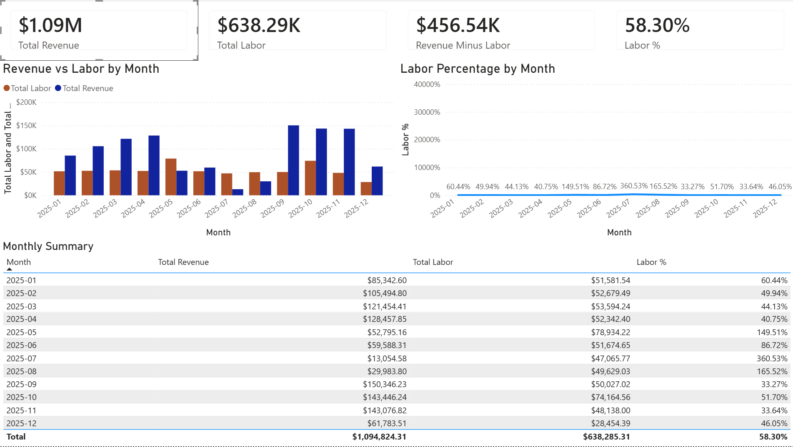

# financial-overview-powerbi
Power BI dashboard analyzing monthly revenue and labor cost to evaluate operational efficiency.

# Key Metrics
- Total Revenue
- Total Labor Cost
- Revenue Minus Labor
- Labor Percentage

# Visuals
- Revenue vs Labor by Month (bar chart)
- Labor Percentage by Month (line chart)
- Monthly summary table

# Data Preparation
The source data was cleaned and transformed prior to analysis. Steps included:
- Removing sensitive client information
- Standardizing month keys
- Aggregating revenue and payroll to monthly totals
Excluded raw data to protect confidentiality.

# Tools Used
- Power BI
- DAX
- Excel (for initial data preparation)

# Notes
Labor percentage represents the proportion of total revenue spent on labor. 

# Dashboard Preview

